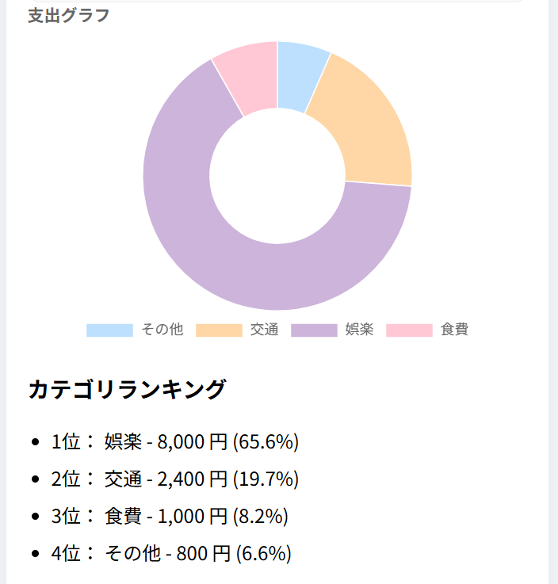
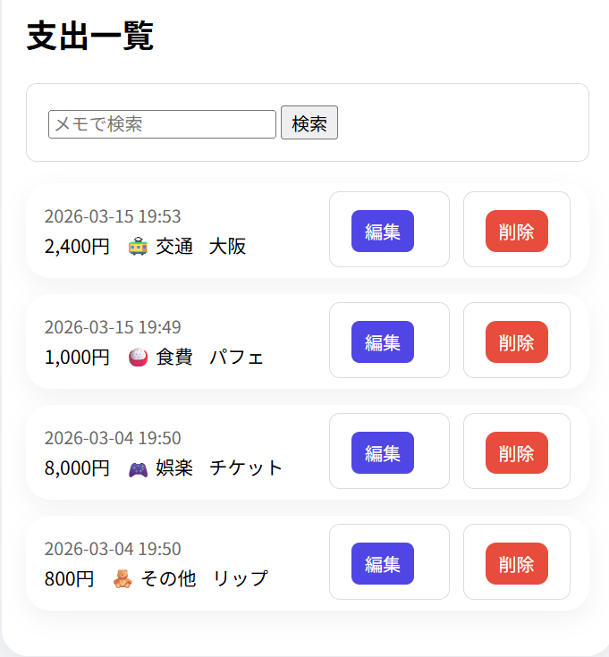

# 家計簿アプリ
シンプルな家計簿アプリです。

## 機能
‐ 支出の追加
‐ 編集・削除
‐ 月ごとの表示
‐ カテゴリ別グラフ表示
‐ メモ検索機能

## 使用技術
‐ Python(Flask)
‐ HTML / CSS
‐ JavaScript (Chart.js)

## 工夫した点
‐ カテゴリにアイコンを追加
‐ グラフを見やすい配色に調整
‐ アプリっぽいデザインに改善

## スクリーンショット

### 📊支出グラフ

### 📋支出一覧
